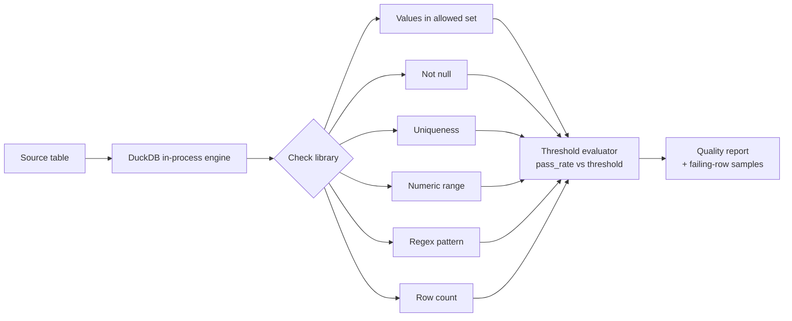

# Data Quality Checks in Plain Python + DuckDB

> Production-grade data quality checks with zero frameworks; no Great Expectations, no Soda, no dbt tests. Just SQL, DuckDB, and ~300 lines of Python you can actually read.

## Problem

Data quality frameworks like Great Expectations are powerful, but for many pipelines they bring heavy dependencies, YAML sprawl, and a steep learning curve; all to answer a simple question: *"does this table look right?"*

This project shows that the core of every data quality tool is one pattern:

**Write a SQL query that selects rows which FAIL the check. Zero rows back = check passed.**

Everything else like thresholds, reports, failure samples is a thin layer on top.

## Architecture



The demo runs against a deliberately dirty `orders` table (duplicate keys, negative amounts, invalid statuses, malformed emails) so every check has something to catch.

Key design choices:

- **DuckDB** as the in-process SQL engine — no server, no setup, and the same SQL translates directly to Postgres, Snowflake, or BigQuery.
- **Threshold-based passing** — real pipelines rarely need 100% perfection. Each check can accept a `pass_threshold` (e.g. 99.5%) and returns a sample of failing rows for debugging instead of a bare pass/fail.
- **PEP 723 inline dependencies** — the script declares its own dependencies, so it runs with `uv run` and zero install.

## Setup

```bash
# Option 1: uv (zero install)
uv run data_quality_demo.py

# Option 2: pip
pip install duckdb
python data_quality_demo.py
```

Requires Python 3.10+.

## Results

Running the demo produces a quality report against the sample table:

```
  DATA QUALITY REPORT — ORDERS

  PASS  row_count between 1 and 10000
  FAIL  order_id is unique
         └─ 1 duplicate found (order_id 1001)
  FAIL  status in allowed set
         └─ pass rate 80.0% (threshold 100.0%)
  FAIL  amount >= 0
         └─ 1 violation: order 1007, amount -50.00
  FAIL  email matches pattern
         └─ 1 violation: 'not-an-email'
```

Each failure includes a sample of the offending rows, so the report doubles as a debugging starting point rather than just a red light.

## When to use this (and when not to)

Use this pattern when you want lightweight, transparent checks embedded in an existing pipeline. Reach for a full framework when you need data docs, cross-team check catalogs, or hundreds of tables under management.

---

*Written up in more detail in my Towards Data Science article (link coming soon). More of my work still early days: [YouTube — codewithIB](https://www.youtube.com/c/codewithib).*
